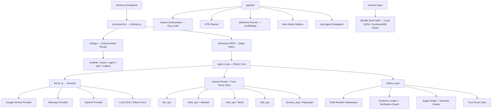

# 🏗️ ANT-CLI Architecture Documentation

This document describes the modular architecture of **ANT-CLI (Agentic Native Task)** v0.3.0.

> 🔄 Terakhir disinkronkan dengan kode aktual (Fase 1 — docs sync). Jika struktur folder berubah lewat refactor Fase 3, perbarui dokumen ini di commit yang sama.

---

## 🏛️ System Overview

ANT-CLI uses a decoupled, event-driven architecture designed for high performance, low-memory footprints (optimised for Android Termux Proot environments), and total agentic autonomy.

---

## 📦 Core Domain Modules

### 1. `src/core/cli/` — Surface Layer
- `index.ts`: Modular CLI boot & interactive REPL loop.
- `boot.ts` / `identity.ts` / `session.ts`: System bootstrap, banner, session persistence.
- `argv/`: Non-interactive subcommand routing (`scaffold`, `swarm`, `agent`, `task`, `mailbox`).
- `commands/`: Slash command dispatchers (memory, model, shell, swarm, system, task).

### 2. `src/core/agent_loop/` — ReAct Core
- `agentLoop.ts`: Core loop — model call → tool detection → approval → execution.
- `toolCallParser.ts`: Brace-matching JSON tool-call extraction.
- `permissions.ts` + `allowlist.ts`: Manual approval gates & shell command policy.
- `contextManager.ts`: Context window bounding & tool-result truncation.
- `evidenceLedger.ts` / `evidenceLocker.ts`: SHA-256 evidence registry (anti-hallucination).
- `verificationGuard.ts` / `researchVerificationGuard.ts`: Blocks unproven claims.
- `judgeBridge.ts` / `semanticGrader.ts` / `diffExtractor.ts`: Sovereign Shield test-quality validation.
- `ui.ts`: Terminal rendering layer (diffs, spinners, markdown) — no decision state.
- `browserTool.ts`: Playwright bridge with its own permission gate.

### 3. `src/core/actions/`
- `file_ops.ts`: Precision file reads, creations, LCS line patching, git diffs/logs, and audit logging.
- `shell_ops.ts`: Restricted shell execution with regex blocklists, VM JS sandbox, npm install validator.
- `web_ops.ts`: Axios HTTP requester, Tavily web search, Playwright bridge fallback, TikTok OSINT.
- `skill_ops.ts`: Skill creation/execution, Knowledge vault queries, semantic memory recall.
- `browser_ops.ts`: Playwright web navigation, DOM click/type, and human rescue triggers.
- `index.ts`: Trust Score gate (`getTrustScore`, `updateTrustScore`) and main action dispatcher.

### 4. `src/core/ai/`
- `router.ts`: Automatic API key detection, provider health monitor, and offline cognitive sandbox.
- `prompts.ts`: Soul configuration loader (`config/soul.yaml`) & system instruction builder — typed via `Soul` / `BrainState`.
- `providers/`: Specialized model callers (`gemini.ts`, `anthropic.ts`, `openai.ts`).
- `tiers/`: Small Local Model (SLM) micro-prompting (`slm.ts`), Sticky Mode depth reasoning (`llm.ts`), and complexity triage (`select.ts`).

### 5. `src/core/agentic/`
- `swarm_orchestrator.ts` / `swarm_report.ts` / `gray_prompts.ts`: ANT-CYBER-CORPS Gray Units audit pipeline (Blackboard JSON → report.json/md).
- `white_unit.ts` / `purple_unit.ts`: Report compilation & OSINT mission units.
- `milestone_runner.ts` + `profiles/next-prisma.json`: State-machine project scaffolding (INIT→SCAFFOLD→IMPLEMENT→VERIFY→SECURE).
- `sub_agents.ts`: Spawns specialized child agents (`researcher`, `coder`, `tester`, `planner`).
- `planner.ts`: Parses goals into High-Level Task Networks (HTN) with step tracking.
- `reflection.ts`: Analyzes tool failures and provides adaptive corrective feedback.
- `branching.ts`: Creates checkpoints and manages conversation branches (`/branch`).
- `mailbox/`: Inter-model relay ledger with channel guard, circuit breaker, claim verifier, file lock.

### 6. Memory & Cognitive Layer
- `src/core/memory/memory.ts`: Semantic memory core (dual-vault: local JSON / CockroachDB vector 768-dim).
- `src/core/memory/mindby_cockroach.ts`: CockroachDB vault adapter & health checks.
- `src/core/memoryAdapter.ts` **deprecated** — tanpa importer aktif; dihapus pada v0.5.
- `tiered_ai.ts`: Complexity-based routing between SLM and cloud LLM.
- `sovereign_seal.ts`: Identity seal blocks injected into system instructions.
- `scheduler.ts` / `autonomy.ts` / `proactive.ts`: Background tasks & proactive behaviors.
- `events.ts` / `events_subscriber.ts` / `event_checklist.ts`: Event-driven bus.
- `healing.ts`: Self-healing error recovery flows.
- `slash_menu.ts` kini di `src/core/cli/slash_menu.ts`; `sovereign_seal.ts` kini di `src/security/` (Fase 3).
- **Deprecated (hapus v0.5)**: `mindby_os.ts`, `mindby_habitat.ts` (alias mati dari `ant_os`/`ant_habitat`), `memoryAdapter.ts`, `verificationStore.ts`.

### 7. `src/security/`
- `auth.ts`: Authentication primitives.
- `fsGuard.ts`: Filesystem access guard.
- `constitutionGuard.ts`: Behavioral constitution enforcement.
- `permissions.ts`: Permission model.
- `sovereign_seal.ts`: Identity seal blocks & response validation with seal (dipindah dari core root — Fase 3).

### 8. `src/utils/` & `src/shared/`
- `logger.ts`, `reasoning_logger.ts`: Glass-box logging of agent decisions.
- `watermark.ts` (+ `tools/verify_watermark.ts`): Output watermarking & verification.
- `shared/data.ts`: Brain config loader (`getBrainConfig`).

---

## 🆕 v0.4-alpha — Ubiquitous Assistant Modules

| Modul | Fungsi |
|-------|--------|
| `src/core/mcp/client.ts` | MCP stdio client (newline-delimited JSON-RPC 2.0): initialize → tools/list → tools/call. |
| `src/core/mcp/registry.ts` | Pool koneksi MCP dari `.ant/mcp.json`; schema tool `mcp__<server>__<tool>` di-merge ke SEMUA provider declarations; routing eksekusi via `actions/index.ts`. |
| `src/core/agent_loop/projectMemory.ts` | Loader `ANT.md` / `.ant/ANT.md` — instruksi proyek persisten di-append ke system instruction semua model (dibungkus delimiter, security fence tetap berlaku). |
| `src/core/cli/argv/one_shot.ts` | Parser headless mode: `ant -p "<task>" [--output-format json] [--sandbox]`. |
| `src/core/cli/commands/custom_commands.ts` | Custom slash commands dari `.ant/commands/*.md` (frontmatter `description`, placeholder `$ARGUMENTS`). |
| `src/core/agent_loop/hooks.ts` | Lifecycle hooks `.ant/hooks.json`: `pre_tool_call` (exit ≥ 2 = veto tool), `post_tool_call` (fire-and-forget). Env: `ANTHOOK_EVENT/TOOL/ARGS/RESULT`. |
| `sub_agents.ts` (v2) | Sub-agent berjalan sebagai agent loop penuh dengan tool access & konteks terisolasi. Approval non-interaktif default **deny** (`ANT_SUBAGENT_AUTO_APPROVE=true` untuk override); nesting maks 2 tingkat; mode lama via `ANT_SUBAGENT_MODE=legacy`. |
| `ai/index.ts` + `tiers/llm.ts` | Native tool calls provider diteruskan apa adanya (`nativeToolCalls`) dan di-bridge ke format JSON block untuk kompatibilitas caller lama. |

---

## 🔒 Security & Trust Gate Architecture

1. **Trust Score Gate**: Every action maintains a dynamic trust score (0 to 100). Destructive actions (`shell_exec`, `delete_file`) require explicit manual approval unless the trust score threshold is met.
2. **Pessimistic Data Resolution**: Dual-write shadow logs (`trust.json` and `trust.shadow.json`) detect data drift or memory tampering and resolve to the pessimistic minimum.
3. **JS VM Sandbox**: Arbitrary JS code runs inside `vm.createContext` with a strict 5-second execution timeout.
4. **Evidence-Based Claims**: Model responses claiming hashes/screenshots/file reads must reference a registered `[EVID:*]` tag; otherwise the Verification Guard blocks the response.
5. **Shell Allowlist**: Default-deny for destructive patterns; auto-approve for dev tools; manual `[y/n/a]` approval fallback.

---

## ✅ Acceptance Gates (CI)

| Gate | Perintah | Kriteria |
|------|----------|----------|
| Typecheck | `npm run typecheck` | 0 error |
| Build | `npm run build` | sukses, `git diff --stat dist` kosong |
| Unit tests | `npm run test:unit` | semua hijau (baseline: 41/41) |
| Full CI | `npm run ci` | ketiganya berurutan |