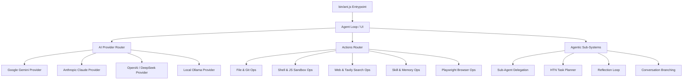

# 🏗️ ANT-CLI Architecture Documentation

This document describes the modular architecture of **ANT-CLI (Agentic Native Task)** v0.1.0.

---

## 🏛️ System Overview

ANT-CLI uses a decoupled, event-driven architecture designed for high performance, low-memory footprints (optimised for Android Termux Proot environments), and total agentic autonomy.

---

## 📦 Core Domain Modules

### 1. `src/core/actions/`
- `file_ops.ts`: Precision file reads, creations, LCS line patching, git diffs/logs, and audit logging.
- `shell_ops.ts`: Restricted shell execution with regex blocklists, VM JS sandbox, npm install validator.
- `web_ops.ts`: Axios HTTP requester, Tavily web search, Playwright bridge fallback, TikTok OSINT.
- `skill_ops.ts`: Skill creation/execution, Knowledge vault queries, semantic memory recall.
- `browser_ops.ts`: Playwright web navigation, DOM click/type, and human rescue triggers.
- `index.ts`: Trust Score gate (`getTrustScore`, `updateTrustScore`) and main action dispatcher.

### 2. `src/core/ai/`
- `providers/`: Specialized model callers (`gemini.ts`, `anthropic.ts`, `openai.ts`).
- `tiers/`: Small Local Model (SLM) micro-prompting (`slm.ts`), Sticky Mode depth reasoning (`llm.ts`), and complexity triage (`select.ts`).
- `router.ts`: Automatic API key detection, provider health monitor, and offline cognitive sandbox.
- `prompts.ts`: Soul configuration loader and system instruction builder.

### 3. `src/core/agentic/`
- `sub_agents.ts`: Spawns specialized child agents (`researcher`, `coder`, `tester`, `planner`).
- `planner.ts`: Parses goals into High-Level Task Networks (HTN) with step tracking.
- `reflection.ts`: Analyzes tool failures and provides adaptive corrective feedback.
- `branching.ts`: Creates checkpoints and manages conversation branches (`/branch`).

---

## 🔒 Security & Trust Gate Architecture

1. **Trust Score Gate**: Every action maintains a dynamic trust score (0 to 100). Destructive actions (`shell_exec`, `delete_file`) require explicit manual approval unless the trust score threshold is met.
2. **Pessimistic Data Resolution**: Dual-write shadow logs (`trust.json` and `trust.shadow.json`) detect data drift or memory tampering and resolve to the pessimistic minimum.
3. **JS VM Sandbox**: Arbitrary JS code runs inside `vm.createContext` with a strict 5-second execution timeout.
