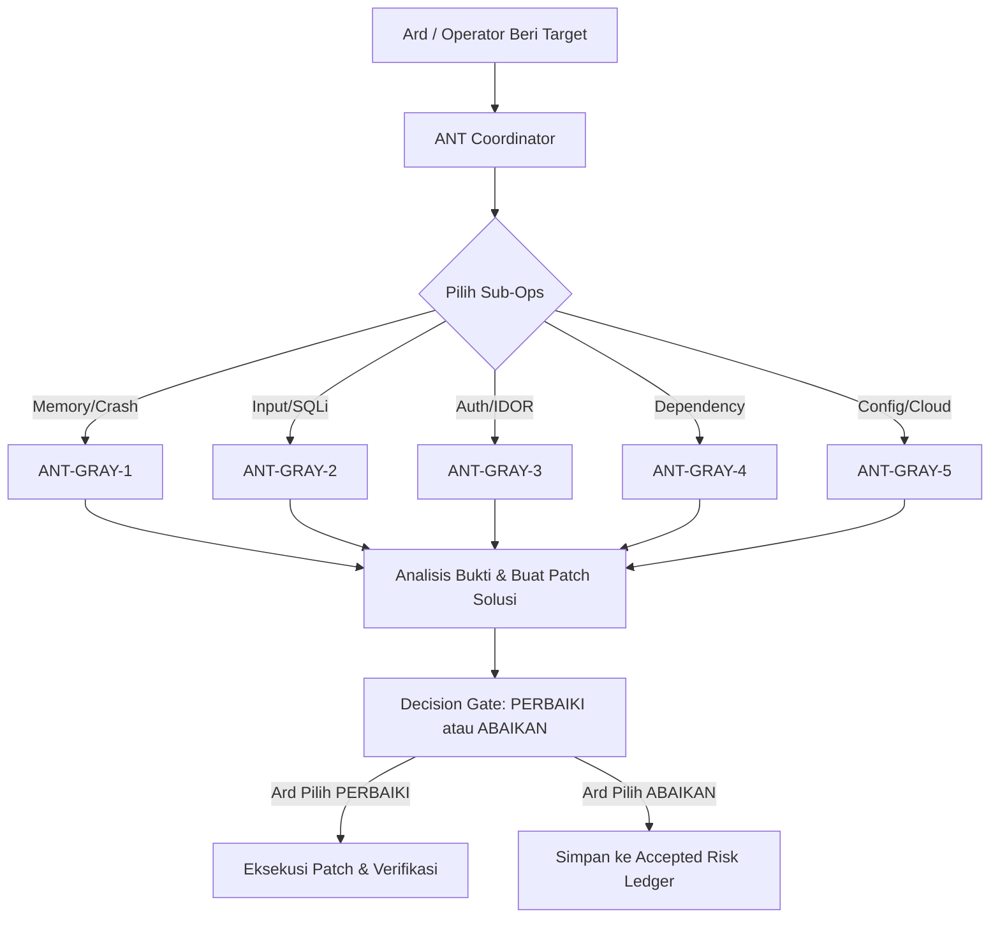

# 🐜 ANT-CYBER-CORPS: MASTER ROADMAP & OPERATIONAL BLUEPRINT

> **Origin & Architecture:** CLUW-Genesis & ANT Sovereign Runtime  
> **Founder / Sovereign Operator:** Renaldy Adri (Ard)  
> **Mission Doctrine:** *"Detect, Analyze, Remediate"* (Bukan Merusak, Melainkan Memperbaiki — Opsi: [PERBAIKI] atau [ABAIKAN])  
> **Core Architecture:** Swarms of Specialists (Base: `Qwen2.5-Coder-0.5B-Instruct` & `Qwen2.5-0.8B-Instruct`)  
> **Last Synced:** 2026-08-15  

---

## 🎯 1. VISI & STRATEGI KOLONI (SWARM OF SPECIALISTS)

Model berukuran **0.5B (INT4 Quantized: ~250–350 MB)** sangat cepat, efisien, dan hemat komputasi. Daripada membuat satu model generalis yang setengah-setengah, ANT-CYBER-CORPS membentuk **5 unit spesialis semut elit** dengan tugas domain yang sangat tajam.

Coordinator utama (**ANT**) bertindak sebagai *The Queen / Hub Commander* yang menerima instruksi dari Ard, mendelegasikan ke sub-ops yang relevan, lalu menyajikan rekomendasi solusi 2 pilihan: **[PERBAIKI]** atau **[ABAIKAN]**.

---

## 🛡️ 2. THE ELITE FIVE (5 SPESIALIS SUB-OPS)

| Unit | Nama Spesialis | Base Model | Domain Target | Dampak Utama |
| :--- | :--- | :--- | :--- | :--- |
| **ANT-GRAY-1** | *The Memory & Logic Guardian* | `Qwen2.5-Coder-0.5B` | Buffer Overflow, Memory Leaks, Race Conditions, Integer Overflow | Mencegah Remote Code Execution & Crash Sistem |
| **ANT-GRAY-2** | *The Input & Injection Sifter* | `Qwen2.5-Coder-0.5B` | SQL Injection, NoSQL Injection, Command Injection, XSS, SSRF | Menjamin Integritas Database & Data Input |
| **ANT-GRAY-3** | *The Auth & Identity Architect* | `Qwen2.5-Coder-0.5B` | Broken Access Control, IDOR, JWT Bypass, Session Hijacking | Menjaga Privilese Admin & Privasi Pengguna |
| **ANT-GRAY-4** | *The Supply Chain Sentinel* | `Qwen2.5-Coder-0.5B` | Vulnerable Dependencies, GitHub Advisory, Prototype Pollution | Menutup Backdoor dari Library Pihak Ketiga |
| **ANT-GRAY-5** | *The Cloud & Config Auditor* | `Qwen2.5-0.8B` | Public Storage/S3, Exposed `.env`, Misconfigured IAM, Docker/TLS | Mengunci Infrastruktur Server & Cloud |

---

## 🔄 3. SIKLUS OPERASIONAL (DECISION GATE LOOP)



---

## 📁 4. STRUKTUR DIREKTORI & DATASET

```text
workspace/
├── ANT_CYBER_CORPS_ROADMAP.md          <-- Master Blueprint ini
└── ant-cyber-corps/
    ├── generate_dataset.js             <-- Generator dataset multi-unit otomatis
    └── datasets/
        ├── gray-1/train.jsonl          <-- Dataset Memory & Logic Defense
        ├── gray-2/train.jsonl          <-- Dataset Input & Injection Sifter
        ├── gray-3/train.jsonl          <-- Dataset Auth & IDOR Architect
        ├── gray-4/train.jsonl          <-- Dataset Dependency & Supply Chain
        └── gray-5/train.jsonl          <-- Dataset Cloud & Config Auditor
```

---

## 🚀 5. STATUS PROGRES & LANGKAH SELANJUTNYA (NEXT STEPS)

- [x] **Inisialisasi Blueprint & Konsep Swarm:** Selesai dan terintegrasi di memori kognitif ANT.
- [x] **Struktur Folder Koloni:** `workspace/ant-cyber-corps/datasets/gray-[1-5]` telah dibuat.
- [x] **Script Generator Dataset:** `generate_dataset.js` siap dijalankan.
- [ ] **Langkah 1 (Setelah Restart):** Jalankan `node workspace/ant-cyber-corps/generate_dataset.js` untuk menghasilkan ribuan sampel SFT bermutu tinggi.
- [ ] **Langkah 2:** Export dataset JSONL ke Kaggle Notebook.
- [ ] **Langkah 3:** Jalankan LoRA / QLoRA 4-bit SFT Training menggunakan Base Model `Qwen2.5-Coder-0.5B-Instruct` di Kaggle GPU.
- [ ] **Langkah 4:** Deploy dan patenkan bobot model di bawah payung **ANT-CYBER-CORPS // Genesis**.
